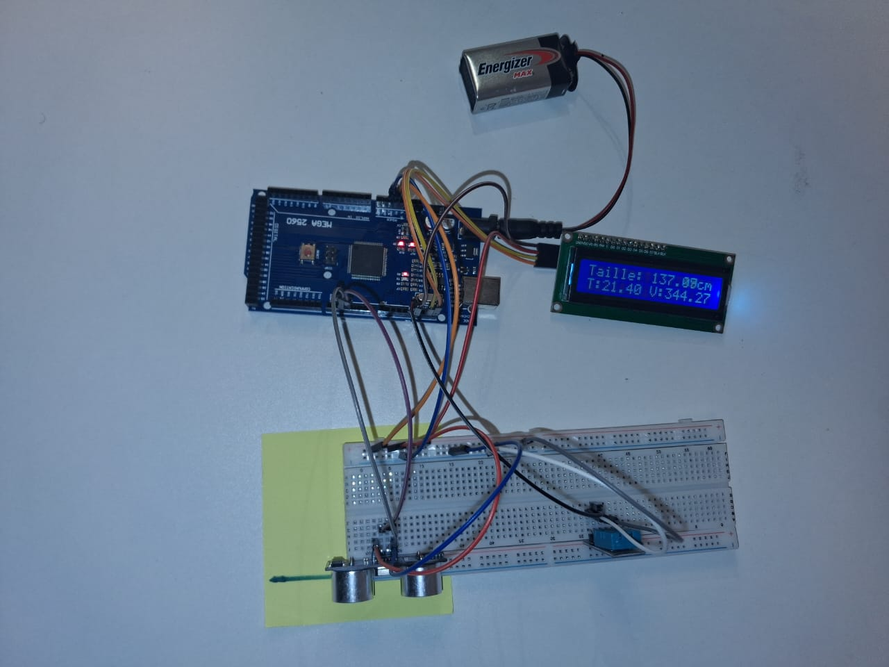
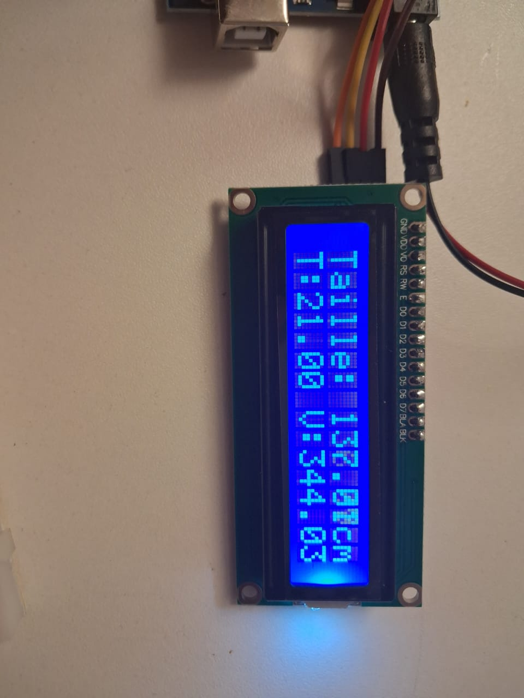

# 📏 Arduino Height Measurement - Analyse d'un Projet "Raté"


> Tentative de mesure de taille humaine avec capteur ultrason HC-SR04 - 
> Analyse des limites matérielles et leçons apprises



## 📋 Contexte

Besoin de connaître ma taille pour un document médical, sans mètre ruban 
disponible. J'ai tenté d'utiliser un capteur ultrason HC-SR04 couplé à un 
DHT11 pour compenser les variations de température.

## 🎯 Objectif Initial

Mesurer avec précision la distance entre le sommet de ma tête et le sol 
en tenant compte de la vitesse réelle du son dans l'air ambiant.

## 🛠️ Hardware Utilisé

- **Arduino Uno**
- **HC-SR04** (capteur ultrason)
- **DHT11** (capteur température/humidité)
- **LCD I2C 16×2** (affichage temps réel)
- **Méthodologie** : Marque au feutre sur le mur → Capteur sur la marque → 
  Mesure jusqu'au sol

## 📐 Approche Physique

### Correction de la vitesse du son

La vitesse du son varie avec la température selon :
```
v(T) = 331.3 + 0.606 × T  (m/s)
```

**Implémentation** :
```cpp
float t = dht.readTemperature();
float v = 331.3 + (0.606 * t);  // m/s
v = v * 0.0001;  // Conversion en cm/µs pour calcul avec pulseIn()

float distance = (duree * v) / 2;  // Division par 2 (aller-retour)
```

### Affichage LCD temps réel



L'écran LCD affiche :
- **Ligne 1** : Distance mesurée en temps réel
- **Ligne 2** : Température ambiante et vitesse du son calculée

## ❌ Résultats Obtenus

**Valeurs mesurées (chaotiques)** :
- 54 cm, 0.07 cm, 189 cm, 12 cm... (complètement aléatoires)
- Aucune stabilité malgré la correction physique

L'écran LCD montre bien le problème : les valeurs changent de façon 
incohérente d'une seconde à l'autre, malgré une température et une 
vitesse du son stables.

## 🔬 Analyse de l'Échec

### 1. Faisceau conique (≈15°), pas un rayon laser

Le HC-SR04 émet un **cône d'ultrasons**, pas un faisceau directionnel :
```
        ╱│╲
       ╱ │ ╲  ← Cône ~15°
      ╱  │  ╲
     ╱   │   ╲
    ╱    │    ╲
   ╱_____│_____╲
   
Détecte : murs latéraux, vêtements, obstacles avant le sol
```

### 2. Surfaces non-planes

- ❌ **Vêtements** : absorption + diffusion des ondes
- ❌ **Formes arrondies** (corps humain) : réflexion multi-directionnelle
- ❌ **Sol irrégulier** : tapis, carrelage, variation de réflexion
- ✅ **Surfaces planes et dures** : réflexion nette (seul cas fiable)

### 3. Absence de stabilisation logicielle

Les mesures brutes sans moyennage amplifient les variations :
- Chaque mesure est indépendante
- Pas de rejet des valeurs aberrantes
- Pas de lissage temporel

## ✅ Solutions Identifiées

### Pour un projet similaire fonctionnel :

#### **1. Amélioration matérielle**
- **Canaliser le faisceau** : Tube PVC de 1m pour limiter le cône
- **Surface de référence** : Plaque métallique au sol (réflexion optimale)
- **Alternative matérielle** : Capteur laser VL53L0X (précision ±1mm, faisceau étroit)

#### **2. Amélioration logicielle** (à ajouter au code)

**Moyenne glissante** :
```cpp
float mesureStable() {
  float sum = 0;
  for(int i = 0; i < 10; i++) {
    sum += mesure(v_son);
    delay(50);
  }
  return sum / 10.0;
}
```

**Rejet des valeurs aberrantes** :
```cpp
float distance = mesure(v_son);
if (distance < 10 || distance > 200) {
  // Hors plage physique réaliste
  return derniere_valeur_valide;
}
```

#### **3. Approche commerciale**

Les toises à ultrason professionnelles utilisent :
- Un **manche rigide** qui sert de guide au faisceau
- Une **surface réfléchissante plane** posée au sol
- Un **filtre médian** sur 20+ mesures

## 🎓 Compétences Développées

- ✅ Application de la physique (acoustique, thermodynamique)
- ✅ Intégration multi-capteurs (DHT11 + HC-SR04 + LCD)
- ✅ Analyse critique des limites matérielles
- ✅ Diagnostic méthodique d'un système défaillant
- ✅ Conversion et gestion d'unités physiques (m/s → cm/µs)

## 💡 Pourquoi Documenter un "Échec" ?

> "L'ingénierie, c'est 90% d'échecs et 10% de succès. 
> Savoir pourquoi ça échoue est aussi important que savoir pourquoi ça marche."

Ce projet illustre :
- La différence entre **théorie** (équations correctes) et **pratique** (contraintes physiques)
- L'importance de **comprendre son matériel** avant de coder
- La capacité à **analyser rationnellement** un résultat inattendu

## 📚 Références

- [Datasheet HC-SR04](https://cdn.sparkfun.com/datasheets/Sensors/Proximity/HCSR04.pdf)
- [Vitesse du son et température](https://en.wikipedia.org/wiki/Speed_of_sound#Practical_formula_for_dry_air)
- [DHT11 Datasheet](https://www.mouser.com/datasheet/2/758/DHT11-Technical-Data-Sheet-Translated-Version-1143054.pdf)

## 📝 License

MIT License - voir [LICENSE](LICENSE)

## 📧 Contact

[](https://www.linkedin.com/in/prince-m-142359248/)